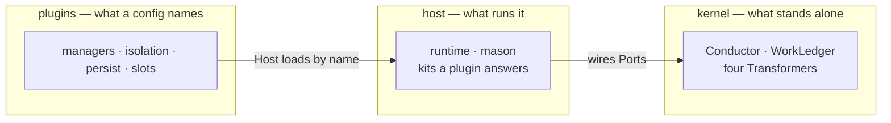

# bluewombat

bluewombat turns a user intention into a delivered solution on its own: it
receives the intention from an external tracker, breaks it into units, executes
and validates each one, then folds the result into a stable work line — without
a human on the happy path.

It is three layers with a one-way dependency. The **kernel** is the
tracker-agnostic core — Conductor, WorkLedger, four Transformers — that speaks
intention, plan, attempt, and directory. The **host** is what runs that core:
the binary **mason**, the loop, and the contracts a plugin answers. **Plugins**
are what a Project names in its config — managers, isolation, persistence,
slots — loaded by name; Host never imports them, and the kernel imports nothing
outside itself.



A third-party package is the same shape in another repository: depend on the
kit from npm, name it in the config. Layout and rules:
[docs/ARCHITECTURE.md](./docs/ARCHITECTURE.md),
[packages/README.md](./packages/README.md).

bluewombat is the system — the npm packages `@bluewombat/*` and the rules they
follow. mason is the name on the binary, the config file, the home directory,
and the labels it writes on a tracker.

This is a 0.x cut. Node.js 24.20 is required. What has been run for real, and
what has not, is in [docs/RESERVATIONS.md](./docs/RESERVATIONS.md).

## Use it

The Project installs the runtime, the tracker it uses, and the slots its config
names:

```bash
mkdir my-project && cd my-project
npm install @bluewombat/runtime @bluewombat/manager-github @bluewombat/slots
export GITHUB_TOKEN=…
npx mason init
```

`init` asks its way through — which manager, what it needs, where the work is
folded in (it can clone that, and refuses a branch the remote does not have) —
writes the files, and runs `setup` itself. Then:

```bash
npx mason doctor
npx mason run
npx mason watch
```

Two things are left for you: the Builder (the stub `mason-builder.mjs`, or
point `builder.producer` and `builder.repair` at a shipped one from
[`@bluewombat/slots`](./packages/plugins/slots/README.md)), and any Gate you add —
each of `planner`, `builder.producer`, `builder.repair`, `assembly.fix` and
`assembly.validate` carries its own `gates`, independently.
Passing `--manager` to `init` turns the questions off, which is what a script wants.

```json
{
  "manager": "@bluewombat/manager-github",
  "managerOptions": { "repo": "owner/name", "labels": ["mason"] },
  "workLine": { "stable": "./work-line-stable" },
  "authority": { "enabled": false },
  "workspaceRoot": "./.mason/workspaces",
  "ledger": "./.mason/ledger",
  "planner": {
    "cmd": ["node", "./node_modules/@bluewombat/slots/planners/one-subtask.mjs"],
    "timeoutMs": 600000,
    "gates": { "defaultTimeoutMs": 120000, "gates": [] }
  },
  "builder": {
    "producer": {
      "cmd": ["node", "./mason-builder.mjs"],
      "timeoutMs": 600000,
      "gates": { "defaultTimeoutMs": 120000, "gates": [] }
    },
    "repair": {
      "cmd": ["node", "./mason-builder.mjs"],
      "timeoutMs": 600000,
      "gates": { "defaultTimeoutMs": 120000, "gates": [] }
    },
    "maxAttempts": 3
  },
  "assembly": { "gates": { "defaultTimeoutMs": 900000, "gates": [] } },
  "timeoutMs": 600000,
  "pollIntervalMs": 30000
}
```

`builder` makes a Subtask. `assembly` judges the whole, and when that
judgement refuses it, `assembly.fix` corrects what it named — not a second
first-pass of the request. The judgement is the `assembly.gates` sequence (the
one no producer runs — nothing new made, the existing assembled state
re-checked), an Authority's own checks, or — optionally — `assembly.validate`,
a local read-only review run before either, judged by its own `gates`, not
`assembly.gates`. Any of them may send work back to `fix`, and all share one
`maxRefusals` budget. `doctor` requires `assembly.fix` exactly when
`authority.enabled` is true; a Project may declare `assembly.validate` with no
`fix` too — a reviewer that only gates, whose refusals escalate on the spot —
and `doctor` says so rather than failing.

`manager` names any package that exports `createManager`; `managerOptions` is
opaque to Host and documented by that package. Another tracker is another
package, and nothing in Host changes —
contract: [`packages/host/manager-kit`](./packages/host/manager-kit/README.md).

Without an Authority, a finished feature is folded into WorkLineStable on this
machine and that is the end of it. With an Authority, the assembled feature is
offered as a Submission — on GitHub, a pull request — and only an accepted
verdict enters the work line. bluewombat does not merge that line onto a further
reference such as `main`; the Authority holds it.

A real Project points `builder.producer` and `builder.repair` at a Builder that
can do the work; the shipped stubs deliberately do nothing.

## Work on it

```bash
nvm use
npm install
npm test
```

To use the CLI while developing, link it once:

```bash
npm run dev:link
```

`mason` is then on your PATH from any directory, pointing at this repository —
`npm run build` is enough to pick up a change. `npm run dev:unlink` removes it.
Details: [docs/DEVELOPMENT.md](./docs/DEVELOPMENT.md).

kernel, host, and plugins share one TypeScript toolchain (Turborepo, npm
workspaces). Open the package you want — [kernel](./packages/kernel/README.md),
[host](./packages/host/README.md), or [plugins](./packages/plugins/README.md) —
and follow the docs next to it for its CLI.

What it is and the rules it follows: [docs/PRODUCT.md](./docs/PRODUCT.md). How
to work in the repo: [docs/DEVELOPMENT.md](./docs/DEVELOPMENT.md).

## Layout

| Directory                                           | Holds                                                                           |
| --------------------------------------------------- | ------------------------------------------------------------------------------- |
| [`packages/kernel/`](./packages/kernel/README.md)   | What stands alone: Conductor, WorkLedger, the four Transformers                 |
| [`packages/host/`](./packages/host/README.md)       | What runs it (`runtime`, the binary `mason`) and the contracts a plugin answers |
| [`packages/plugins/`](./packages/plugins/README.md) | What a config names: managers, isolation strategies, persistence, slots         |
| [`docs/`](./docs/INDEX.md)                          | Product, layout, toolchain, decisions, reservations                             |

## Stack

TypeScript, Node.js 24.20, Biome, the Node.js test runner via `tsx`, npm
workspaces, Turborepo. Details: [docs/DEVELOPMENT.md](./docs/DEVELOPMENT.md).
The product itself ([docs/PRODUCT.md](./docs/PRODUCT.md)) names none of this
on purpose.

## Documentation

**[docs/INDEX.md](./docs/INDEX.md)** routes to everything — start there.

| Entry point                                    | For                                                 |
| ---------------------------------------------- | --------------------------------------------------- |
| [docs/INDEX.md](./docs/INDEX.md)               | Finding the right document without reading them all |
| [AGENTS.md](./AGENTS.md)                       | AI-assisted work — read first                       |
| [docs/DEVELOPMENT.md](./docs/DEVELOPMENT.md)   | Running and changing it locally                     |
| [docs/PRODUCT.md](./docs/PRODUCT.md)           | What it does, the rules, the words                  |
| [docs/ARCHITECTURE.md](./docs/ARCHITECTURE.md) | Understanding how it is built                       |
| [packages/README.md](./packages/README.md)     | Who exists, who may import whom                     |
| [docs/DECISIONS.md](./docs/DECISIONS.md)       | Understanding why                                   |
| [docs/RESERVATIONS.md](./docs/RESERVATIONS.md) | What is not settled, and what was never proved      |
