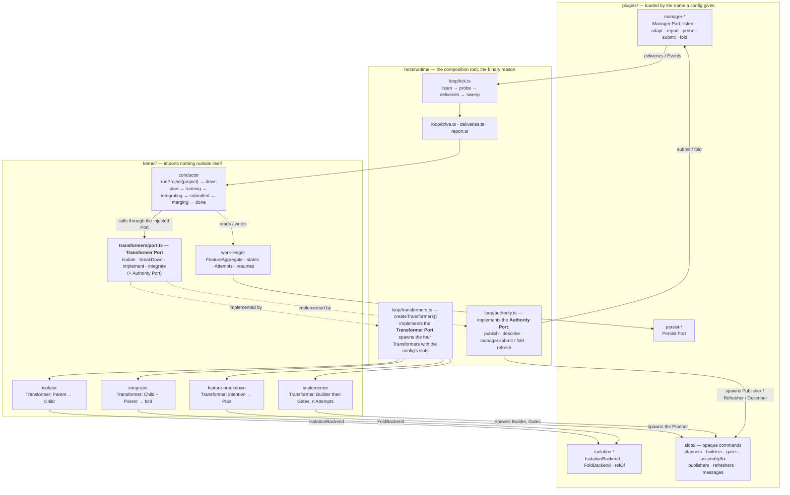

# Architecture

Root `docs/` describes the **global** layout, the shared toolchain, and
cross-cutting runtime concepts. A Transformer documents its own binary and CLI
next to its code (`packages/kernel/README.md` § Transformers is the shared IN/OUT contract).

The runtime map below is the product's workflow, from
[PRODUCT.md](./PRODUCT.md). The directory map is the present repository shape.

## Map

Happy path: the manager delivers an issue → Host admits it (`received`) →
Conductor claims it and drives: Breakdown (Planner slot) → Isolator (a
directory) → Implementer (Builder slot, then Gates) → Integrator (the Subtask
folded into the feature directory) → assembly Gates → Submission through the
Authority Port (Publisher slot, then the manager opens the pull request) →
`ci-green` → fold → `done`, reported back through the manager. Each
Transformer's IN/OUT is in its own `SPECS.md`; who invokes whom, in
[`packages/README.md`](../packages/README.md).

## Vocabulary

Six words carry the whole build, and each names one kind of thing. Using one
for another is how "glue" and "Brick" crept in; a new piece is one of these or
it needs a decision.

| Word            | Means                                                                                                                                                   | Where                                                          | Examples                                                              |
| --------------- | ------------------------------------------------------------------------------------------------------------------------------------------------------- | -------------------------------------------------------------- | --------------------------------------------------------------------- |
| **Transformer** | A kernel unit: one IN, one OUT, its own binary. Knows no tracker, no tool                                                                              | `packages/kernel/{isolator,implementer,integrator,feature-breakdown}` | Isolator, Implementer, Integrator, FeatureBreakdown                   |
| **Port**        | A contract injected into a kernel piece by whoever wires it; the kernel never imports its implementation                                               | `conductor/src/transformers/port.ts`, `manager-kit`, `work-ledger`  | Transformer Port, Authority Port, Manager Port, Persist Port          |
| **Plugin**      | A package a config names and Host loads at run time, answering one Port or one strategy `Shape`                                                        | `packages/plugins/{manager,isolation,persist}-*`                     | `manager-github`, `isolation-git`, `persist-fs`                       |
| **Slot**        | An opaque command a config names and a Transformer or Host spawns; it prints one JSON line. Never imported                                             | `packages/plugins/slots/**`, any script                              | Planner, Builder, Gate, assembly fix, assembly validate, Publisher, Refresher, Describer |
| **Backend**     | A plugin as one Transformer sees it: the part of an isolation strategy Isolator or Integrator calls                                                     | `IsolationBackend`, `FoldBackend`                                    | `isolation-git`'s worktree and merge                                  |
| **Kit**         | What a plugin author imports to answer a contract: the types and the plumbing worth sharing                                                            | `packages/host/{manager-kit,slot-kit}`                               | `@bluewombat/manager-kit`, `@bluewombat/slot-kit`                     |

Retired: *glue* (now Host's `loop/`), *Block* (now Transformer), *Brick* (now
Transformer Port). The product's own words — Feature, Subtask, Attempt, Gate,
Authority, Submission — are in [PRODUCT.md](./PRODUCT.md)'s glossary.

## Areas

The authoritative map of the repository. Globs, not a directory tree — a tree goes stale
on every refactor, a glob survives one.

| Area         | Glob                                                                  | Responsibility                                                                                                                 | Must not                                                                                                    |
| ------------ | --------------------------------------------------------------------- | ------------------------------------------------------------------------------------------------------------------------------ | ----------------------------------------------------------------------------------------------------------- |
| Kernel       | `packages/kernel/**`                                                  | Tracker-agnostic core: Conductor, WorkLedger, the four Transformers. Imports nothing outside itself                            | Know a tracker, a git remote, or a persistence file format; import a kit or a plugin                        |
| Transformers | `packages/kernel/{isolator,implementer,integrator,feature-breakdown}` | One IN, one OUT, binary + CLI. Shared contract in [`packages/kernel/README.md`](../packages/kernel/README.md) (§ Transformers) | Depend on another Transformer or a kernel sibling; hold examples or regressions; choose a private toolchain |
| Host         | `packages/host/**`                                                    | `runtime`: the composition root and the binary `mason`. `manager-kit`, `slot-kit`: the contracts a plugin answers              | `runtime` importing a plugin; a kit depending on anything in the repository                                 |
| Plugins      | `packages/plugins/**`                                                 | What a config names and Host loads or spawns: managers, isolation strategies, persistence backends, slots                      | Import `runtime` or another plugin; be imported by the kernel                                               |
| Root docs    | `docs/**`                                                             | Product, global layout, shared toolchain, cross-cutting concepts, decisions, reservations                                      | Document a package's internals or CLI                                                                       |

Dependencies point one way — `plugins → host (kits) → kernel`, and
`host/runtime → kernel` — and three scripts refuse the reverse:
`check-kernel.mjs`, `check-host.mjs`, `check-plugins.mjs`, all in `npm run lint`.

Every top-level source directory should appear in exactly one row.

## Entry points

Where execution actually begins. This is the first thing a newcomer or an agent looks for.

| Trigger                        | Entry point                                                                                              | Notes                                                                                                                                                               |
| ------------------------------ | -------------------------------------------------------------------------------------------------------- | ------------------------------------------------------------------------------------------------------------------------------------------------------------------- |
| Work on one Transformer        | a directory under `packages/kernel/` (e.g. `packages/kernel/implementer`)                                | That Transformer's own binary and docs. Shared contract: [`packages/kernel/README.md`](../packages/kernel/README.md) (§ Transformers). They do not start each other |
| Work on the kernel             | `packages/kernel/conductor`, `packages/kernel/work-ledger`                                               | Not a Transformer. Conductor may import WorkLedger. Transformers must not import these                                                                              |
| Work on Host                   | `packages/host/runtime` (layers: its README § Layers); a contract change starts in `packages/host/*-kit` | Host is the composition root. Managers and ledger adapters live here. Transformers do not import them                                                               |
| FeatureManager event           | `mason run` (`packages/host/runtime`)                                                                    | Host owns the Cursor and drives the manager package named in the config: listen → probe → adapt → Conductor → report. Host does not know a tracker.                 |
| Process start / crash recovery | `mason run` — Host loads the Cursor and Conductor reconciles                                             | Orphans are destroyed; the WorkLedger decides                                                                                                                       |
| Global pause                   | SIGINT / SIGTERM on `mason` — Conductor `pause`                                                          | Current Delivery may finish; no new listen tick                                                                                                                     |
| Emergency stop                 | Implementer interrupt (Transformer exists; wiring not built)                                             | Interrupt; affected Subtasks become `runnable`; isolated spaces destroyed                                                                                           |
| Run one Task in a workspace    | `packages/kernel/implementer` binary                                                                     | Builder then Gates; see that Transformer's README                                                                                                                   |
| Isolate a Parent into a Child  | `packages/kernel/isolator` binary                                                                        | Snapshot working files; git or copy; see that Transformer's README                                                                                                  |
| Fold a Child into a Parent     | `packages/kernel/integrator` binary                                                                      | Working-file fold; git or copy; never forced; see that Transformer's README                                                                                         |
| Run one Breakdown              | `packages/kernel/feature-breakdown` binary                                                               | FeatureStandard in; Plan or refuse; see that Transformer's README                                                                                                   |

## Extension points

How to add the things this project adds most often. Each row should let someone make
a correct change without reading the whole codebase.

| To add a…              | Touch                                                                                                                                 | Then                                                                                                                                                                                                                                                                                                                                                                                                                                                                    |
| ---------------------- | ------------------------------------------------------------------------------------------------------------------------------------- | ----------------------------------------------------------------------------------------------------------------------------------------------------------------------------------------------------------------------------------------------------------------------------------------------------------------------------------------------------------------------------------------------------------------------------------------------------------------------- |
| New Transformer        | A new directory under `packages/kernel/` (sibling of `isolator`, …); add it to `scripts/check-kernel.mjs`                             | Workspace package: export + CLI, same scripts as siblings. Obey [`packages/kernel/README.md`](../packages/kernel/README.md) (§ Transformers). `scripts/check-kernel.mjs` must pass. CLI docs stay next to it; the stack is [DEVELOPMENT.md](./DEVELOPMENT.md)                                                                                                                                                                                                           |
| New kernel package     | A new directory under `packages/kernel/` that is not a Transformer                                                                    | Not IN/OUT-shaped. Conductor may import WorkLedger. A Transformer must not. See [`packages/kernel/README.md`](../packages/kernel/README.md)                                                                                                                                                                                                                                                                                                                             |
| New Isolation strategy | A `packages/plugins/isolation-*` package exporting `strategy`                                                                         | Host loads it from `workLine.isolation` like a manager. Isolator and Integrator keep contracts only.                                                                                                                                                                                                                                                                                                                                                                    |
| New FeatureManager     | A `packages/plugins/manager-*` package implementing `@bluewombat/manager-kit`                                                         | Listen / adapt / report live inside that package, and so do the optional `scaffoldManager` (`init`), `checkManager` (`doctor`) and `setupManager` (`setup`) hooks. Host does not change. Core still speaks only FeatureStandard / Subtask. A tracker's fields stay in `managerOptions` or in an opaque slot command.                                                                                                                                                    |
| New WorkLedger backend | A `packages/plugins/persist-<name>` package implementing the Persistence Port                                                         | The ledger package does not change. It exports `openPersist({ ledgerRoot })`; a Project names it in `persist` and Host loads it like a manager.                                                                                                                                                                                                                                                                                                                         |
| New Gate               | `packages/plugins/slots/gates/` (an opaque command in Project config)                                                                 | One sequence per role — `planner.gates`, `builder.producer.gates`, `builder.repair.gates`, `assembly.fix.gates`, `assembly.validate.gates` — plus `assembly.gates` for the produce:false judgement-only pass (re-checking the assembled feature, no producer of its own). No sharing, no dispatch choosing between buckets: a check right for one pass is not necessarily right for another, even within the same stage, and a repair with no Gate of its own runs ungated rather than inheriting the producer's. Shipped examples: `parent-clean`, `sensitive-path`, `workspace-changed`, `ci-green`. A Gate outside this repository needs no package at all: it is any command that prints the verdict line. Plumbing for one written in Node: `packages/host/slot-kit`. |
| New Builder            | `packages/plugins/slots/builders/` or `packages/plugins/slots/assembly/` (a role command in Project config, with an agent after `--`) | A role fills its placeholders and spawns `packages/plugins/slots/agents/`. The Builder stays opaque; it receives intention, on a Subtask its definition of done, and on retry the failing Gate's report. A Task may have none, and is then its Gate sequence alone. Assembly has no first-pass producer and no definition of done: `assembly/fix.mjs` runs only after a judgement of the whole refused it. Host does not pick a producer. Plumbing for one written in Node: `packages/host/slot-kit`.              |
| New Planner            | `packages/plugins/slots/planners/` (an opaque command in Project config)                                                              | FeatureStandard in, a Plan out. A Plan it cannot produce is a refusal on stdout; a Plan it produced wrong is a non-zero exit, so the Breakdown is retried rather than the feature buried. Shipped examples: `one-subtask` (the bootstrap one `init` writes), `agent`.                                                                                                                                                                                                   |
| New Authority          | A manager package declaring `submit` / `fold`, and a Publisher slot                                                                   | The Submission lives in that package; how the work is placed in front of it is the Publisher's business. Conductor receives an `AuthorityPort` and never learns what an Authority is made of. Declaring neither method keeps the local fold.                                                                                                                                                                                                                            |
| New bound              | A key in the Project config, read by `runtime/src/config`                                                                             | Breach escalates; it does not fail silently                                                                                                                                                                                                                                                                                                                                                                                                                             |

## Invariants

Rules the architecture depends on. Breaking one is not a refactor — it needs a decision
entry in [DECISIONS.md](./DECISIONS.md).

- Durable state is written to the WorkLedger before any action. Workspaces never lead.
- The core does not know a concrete FeatureManager. Admission is Adapter-in, Emitter-out.
- Only a manager package reaches a tracker. `setupManager` is the one hook that may
  write to one before a run, and only when `mason setup --apply` asks; `checkManager`
  stays offline so `mason doctor` answers the same with or without a network.
- One active FeatureStandard per Project; one running Subtask per feature.
- The Project's Gate sequence is the only validation path, in order, at Subtask level
  and again on the assembled feature.
- WorkLineStable pre-exists when it is the operator's. When an Authority holds the
  reference, the directory is Host's copy of it: fetched from what the manager names,
  refreshed, never rewritten. Nothing after the reference (release, deploy) is this
  process.
- An escalation without a Trace is invalid when an Attempt exists.
- Visibility never changes what a run does. A journal, a `--on-status` command,
  a stream sink: each may fail, hang, or be absent, and the Task carries on. The
  three levels differ in what they promise — the WorkLedger is truth and is
  never lost, the journal is written synchronously so it lands before the next
  phase, a stream is written asynchronously and may be lost — and none of them
  is on the path of the work.
- After a crash, reconciliation is WorkLedger-first: isolated spaces that do not match
  are destroyed.
- Transformers are independent: no Transformer depends on another Transformer,
  a kernel sibling, or a plugin. Combinations live in Host. Conductor may
  import WorkLedger.
- The repository stack is TypeScript / Node 24.20 / Biome / `node:test`,
  orchestrated by Turborepo (`turbo.json`).
- A Transformer is a function, and its CLI is an adapter over that function. The run function
  is reachable from an import entry point; the CLI only reads argv and stdin, calls it,
  and maps the outcome to an exit code. No behaviour lives in the CLI alone.
- Root `docs/` does not describe a Transformer's internals.
- WorkLedger persistence adapters are packages under `packages/`. The ledger owns
  the Port; it does not import `node:fs` or `node:sqlite`.

Most runtime invariants are not enforced by code yet. Four Transformers enforce their own
rules in isolation: `packages/kernel/implementer` (Attempt / Gate / Trace),
`packages/kernel/isolator` (Parent → Child, git or copy),
`packages/kernel/integrator` (Child + Parent → `integrated` / `conflict`, git
or copy, never forced), and `packages/kernel/feature-breakdown` (FeatureStandard /
Plan / Planner). FeatureManager listen / adapt / report live inside
`packages/plugins/manager-fake` and `packages/plugins/manager-github`. The glue
is Host, and Host's own suite runs the whole chain against the fake manager.
Admission is proven by that suite too. WorkLedger lives under
`packages/kernel/work-ledger`. Persistence adapters under `packages/plugins/persist-fs` and
`packages/plugins/persist-sqlite`. Conductor lives under `packages/kernel/conductor`. Host under
`packages/host/runtime` loads one manager package through `@bluewombat/manager-kit`; it does not
import a tracker.

## Boundaries and dependencies

| Depends on                                                                 | Why                                                | Escape hatch if it disappears                                                         |
| -------------------------------------------------------------------------- | -------------------------------------------------- | ------------------------------------------------------------------------------------- |
| FeatureManager (concrete tool not chosen)                                  | Human surface for intentions and escalations       | Swap Adapter / Emitter; core unchanged                                                |
| Isolation / versioning tool (package under `packages/plugins/isolation-*`) | WorkSpaceFeature, WorkSpaceSubtask, WorkLineStable | Swap the Isolation strategy package in `workLine.isolation`; WorkLedger remains truth |
| Builder (not chosen)                                                       | Produce a Subtask in isolation                     | Swap the producer; Implementer and Gates stay                                         |

## What this system does not do

Deliberate non-capabilities, so nobody re-implements them by accident.

- Parallel Subtasks inside one feature
- Automatic re-breakdown of an in-flight feature
- Concurrent features on the same Project
- Automatic revert of a feature already in WorkLineStable
- Human approval on every happy-path step
- Anything after WorkLineStable (push, pull request, release, production, publication)
- A shared *runtime* library that Transformers import (`packages/shared` or similar)
- Root documentation of a Transformer's binary or everyday CLI

## Deeper detail

- Domain rules and glossary: [PRODUCT.md](./PRODUCT.md)
- Why it is like this: [DECISIONS.md](./DECISIONS.md)
- Imperfect cases, the human surface, emitter events: [PRODUCT.md](./PRODUCT.md); the states in full: [`packages/kernel/work-ledger/SPECS.md`](../packages/kernel/work-ledger/SPECS.md)
- Implementer Transformer (behavioural spec): [`packages/kernel/implementer/SPECS.md`](../packages/kernel/implementer/SPECS.md)
- Isolator Transformer (behavioural spec): [`packages/kernel/isolator/SPECS.md`](../packages/kernel/isolator/SPECS.md)
- Integrator Transformer (behavioural spec): [`packages/kernel/integrator/SPECS.md`](../packages/kernel/integrator/SPECS.md)
- FeatureBreakdown Transformer (behavioural spec): [`packages/kernel/feature-breakdown/SPECS.md`](../packages/kernel/feature-breakdown/SPECS.md)
- Transformer contract (all of them): [`packages/kernel/README.md`](../packages/kernel/README.md) (§ Transformers)
- Operator live view (`mason watch` / `status`), the journal, and what a run films of its children: [`packages/host/runtime/SPECS.md`](../packages/host/runtime/SPECS.md) § 8; what it still lacks: [RESERVATIONS.md](./RESERVATIONS.md) § I10, I12–I15
- Kernel packages: [`packages/kernel/README.md`](../packages/kernel/README.md)
- Host and its kits: [`packages/host/README.md`](../packages/host/README.md)
- Plugins: [`packages/plugins/README.md`](../packages/plugins/README.md)
- WorkLedger behavioural spec: [`packages/kernel/work-ledger/SPECS.md`](../packages/kernel/work-ledger/SPECS.md)
- Conductor behavioural spec: [`packages/kernel/conductor/SPECS.md`](../packages/kernel/conductor/SPECS.md)
- Host behavioural spec: [`packages/host/runtime/SPECS.md`](../packages/host/runtime/SPECS.md)
- FeatureManager plugin contract: [`packages/host/manager-kit/SPECS.md`](../packages/host/manager-kit/SPECS.md)

## Verifying this document

`covers` above declares which files this document describes. A change to those
files is a change to this document, in the same commit. Keep this file on the
layout and the cross-cutting map; a package's internals go next to its code.
