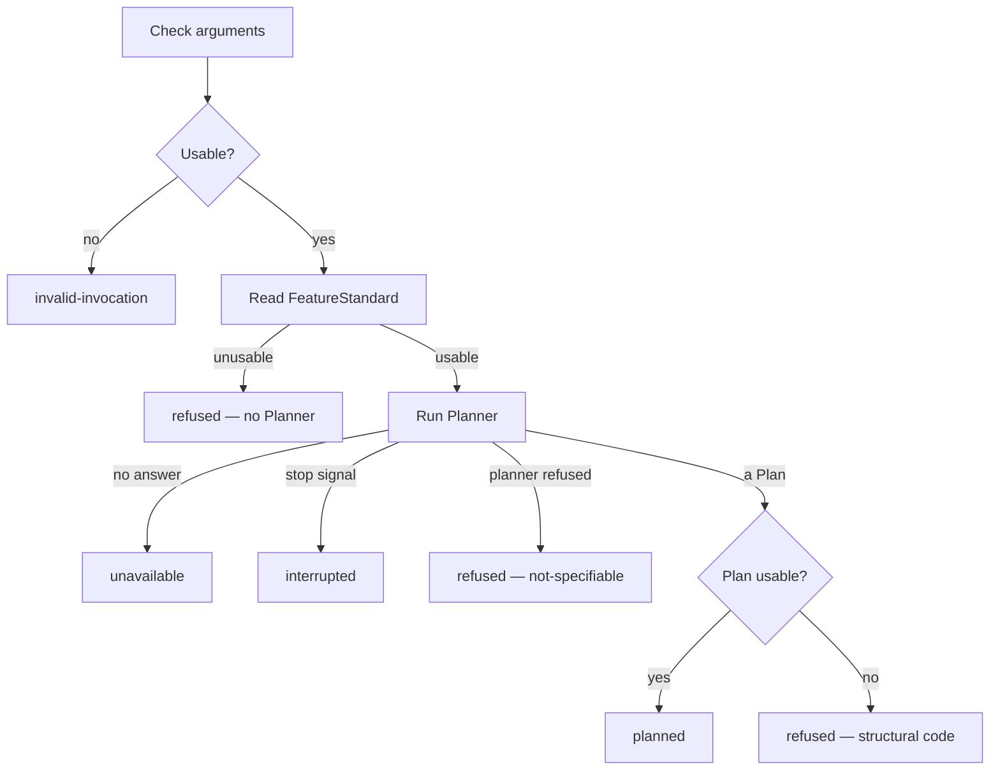

# FeatureBreakdown

Independent Transformer: it has a binary, a contract, and nothing else. This paragraph
is the only place this spec talks about the rest of the system. From here on,
FeatureBreakdown is alone. Its code, identifiers, comments, and messages name
only what it owns: the FeatureStandard, the Planner, the Plan, Subtasks,
dependencies, bounds, Status, clocks, and the run outcome. No other component is
mentioned there, because none of them exist inside this perimeter.

FeatureBreakdown runs **one Breakdown**. It takes one FeatureStandard and
produces one Plan — Subtasks with intentions, definitions of done, and
dependencies — or refuses. It does not execute a Subtask. It does not create a
directory. It does not store the Plan.

The invocation is always the same. FeatureBreakdown does not invent Subtasks
itself: a Planner does. FeatureBreakdown checks the FeatureStandard, runs the
Planner once, checks the Plan, and stops.

Stack and binary layout: [README.md](./README.md).

## 1. Job

```
  arguments                      FeatureBreakdown                 children
  ---------                      ----------------                 --------
  FeatureStandard                one invocation                   Planner, at most once
  Planner                        check, plan, check
  bounds                         until a run outcome
                             ←   Plan, or refused + code + reason
```

**In:** one FeatureStandard plus arguments. **Out:** one run outcome, a live
Status each time it changes, and one `result` line on stdout. FeatureBreakdown
writes no file, opens no directory, and never calls back into anything. It does
not wait for a listener to acknowledge.

## 2. Options

FeatureBreakdown is invoked with arguments. It does not read a configuration
file. It does not read a directory of work.

| Argument                 | Content                                                                                                   |
| ------------------------ | --------------------------------------------------------------------------------------------------------- |
| `--feature <json>`       | The FeatureStandard, as one JSON argument. Omitted: the FeatureStandard is read from **stdin** until EOF. |
| `--max-feature-bytes`    | Positive integer. Size ceiling of the FeatureStandard, before parsing.                                    |
| `--max-units`            | Positive integer. Ceiling on how many Subtasks a Plan may contain.                                        |
| `--planner -- <argv…>`   | Planner command. Non-empty.                                                                               |
| `--planner-duration-ms`  | Positive integer. Wall clock of the Planner.                                                              |
| `--on-status -- <argv…>` | Optional. Command to run each time Status changes. Omitted: Status still goes to stdout.                  |
| `--at <iso>`             | Optional. Value stamped as `planned_at`. Omitted: the current time.                                       |

No other argument is read.

Malformed arguments, empty command, missing `--planner`, missing
`--planner-duration-ms`, `--feature` together with a stdin FeatureStandard, or a
non-positive bound → run outcome `invalid-invocation`. Nothing is read, nothing
is spawned.

`invalid-invocation` is about **this call**. A FeatureStandard that cannot be
planned is not an invocation error: it is the outcome `refused`, which is a
complete run with a verdict.

Giving `--feature` means stdin is not read at all.

## 3. FeatureStandard

One JSON object. The input shape FeatureBreakdown **reads** is closed: these
fields, no more. A field it does not read is ignored, never copied onto the
Plan.

| Field                 | Accepted                                          | Role                               |
| --------------------- | ------------------------------------------------- | ---------------------------------- |
| `key`                 | Non-empty string                                  | Identity of this FeatureStandard   |
| `intention`           | Non-empty string after trim                       | What to split                      |
| `title`               | String. Optional.                                 | Passed to the Planner when present |

Strings are trimmed. A recognised field present but of the wrong type is a
refusal, not a silent fallback.

Over `--max-feature-bytes`, unparseable, or parsed to anything other than an
object → `refused`. No Planner.

A FeatureStandard FeatureBreakdown will send to the Planner has a `key` and a
non-empty `intention`. Anything less → `refused`, no Planner.

There is no state, no attempt counter, no directory path in this document.
Those belong to whoever stores a Plan, and this Transformer does not store one.

## 4. Workflow

One invocation runs one Breakdown. There is no loop.

```
Check arguments (§2). Unusable → `invalid-invocation`.
Read and check the FeatureStandard (§3). Unusable → `refused`, no Planner.
Announce Status `planning`.
Start the Planner clock.
Run the Planner once (§5).
  If the clock fires, a stop signal arrives, or the Planner does not answer
    → run outcome `unavailable` or `interrupted` (§7).
  If the Planner refuses the FeatureStandard
    → run outcome `refused` with that reason.
  If the Planner returns a Plan
    → check the Plan (§6).
      Usable   → run outcome `planned`.
      Unusable → run outcome `refused` with the first failing code.
```



Argument checks, FeatureStandard checks, and Plan checks are pure functions of
values: no process spawn inside those functions, so they are testable without a
Planner.

## 5. Planner

`--planner` is the split slot. FeatureBreakdown does not split. The Planner
does, once, and this process judges the result.

It runs with this Transformer's own working directory (this Transformer owns no directory)
and these arguments appended:

| Argument                | Content                                                             |
| ----------------------- | ------------------------------------------------------------------- |
| `--key`                 | From the FeatureStandard                                            |
| `--intention`           | From the FeatureStandard                                            |
| `--max-units`           | From `--max-units`                                                  |
| `--title`               | From the FeatureStandard. Omitted when the FeatureStandard has none |

FeatureBreakdown sets no extra environment variables of its own (the process
still inherits the environment).

Stdout must be one JSON object.

A Plan:

```json
{
  "subtasks": [
    {
      "id": "st-1",
      "intention": "Add the CSV serializer",
      "definition_of_done": "A unit test writes a CSV matching the fixture",
      "depends_on": []
    }
  ]
}
```

A refusal from the Planner:

```json
{
  "outcome": "refused",
  "code": "not-specifiable",
  "reason": "The intention asks for two contradictory results."
}
```

`outcome` on that optional JSON is only `refused`. Other fields on a refusal
are ignored except `code` and `reason`. A `code` other than `not-specifiable`,
or a missing `code`, is stored as `not-specifiable`. `reason` must be a
non-empty string; missing → FeatureBreakdown writes a reason that the Planner
refused without saying why.

If both `outcome: "refused"` and `subtasks` are present, the refusal wins and
`subtasks` is ignored.

| What happened                                          | Result                    |
| ------------------------------------------------------ | ------------------------- |
| Exit 0, stdout is a Plan object                        | Check the Plan (§6)       |
| Exit 0, stdout is a refusal object                     | Run outcome `refused`     |
| Exit 0, stdout is empty, unparseable, or not an object | Run outcome `unavailable` |
| Non-zero exit, no refusal object                       | Run outcome `unavailable` |
| Killed by `--planner-duration-ms`                      | Run outcome `unavailable` |
| Cannot spawn (not found, not executable)               | Run outcome `unavailable` |
| Stdout + stderr over 8 MiB                             | Run outcome `unavailable` |
| Stop signal                                            | Run outcome `interrupted` |

A Planner failure never produces `refused`. `refused` means *this FeatureStandard
cannot be planned*, which is a verdict on the FeatureStandard or on a Plan that
was actually returned. A Planner that did not answer says nothing about either
and must be retryable.

The Planner is skipped entirely when the FeatureStandard is already `refused`:
there is nothing to split.

## 6. Plan

The output shape is closed: these fields, no more. A field with no value is
absent, never `null`. Unknown keys on the Planner's object, and unknown keys on
a Subtask, are dropped.

```json
{
  "key": "fake:42",
  "subtasks": [
    {
      "id": "st-1",
      "intention": "Add the CSV serializer",
      "definition_of_done": "A unit test writes a CSV matching the fixture",
      "depends_on": []
    },
    {
      "id": "st-2",
      "intention": "Wire the export button",
      "definition_of_done": "Clicking Export downloads the CSV",
      "depends_on": ["st-1"]
    }
  ],
  "fingerprint": "sha256:1f0c…",
  "planned_at": "2026-09-05T10:00:00.000Z"
}
```

| Field         | Content                                                                                             |
| ------------- | --------------------------------------------------------------------------------------------------- |
| `key`         | From the FeatureStandard. Copied, never rewritten.                                                  |
| `subtasks`    | The list, in the Planner's order. FeatureBreakdown does not sort, rank, or pick an execution order. |
| `fingerprint` | `sha256:` + hex of the canonical JSON of `key` and `subtasks` (see below).                          |
| `planned_at`  | From `--at`, or the current time. ISO-8601 with milliseconds.                                       |

`fingerprint` answers *did this Plan change?* It is computed, never looked up:
FeatureBreakdown has no memory. Canonical JSON for the fingerprint sorts
`subtasks` by `id` and sorts each `depends_on` list. The emitted `subtasks`
array is still the Planner's order; `depends_on` is still the Planner's order
after duplicate ids in that one list are dropped, first occurrence kept.

`planned_at` is not in the fingerprint: the same Plan at two times is the same
Plan.

There is no Subtask state in this document. A Plan is a graph of work, not a
progress log.

### Subtask

| Field                | Accepted                                                | After check                        |
| -------------------- | ------------------------------------------------------- | ---------------------------------- |
| `id`                 | Non-empty string, or a finite number (rendered decimal) | Unique in this Plan                |
| `intention`          | Non-empty string after trim                             | The prompt for this unit           |
| `definition_of_done` | Non-empty string after trim                             | How this unit is declared finished |
| `depends_on`         | Array of ids in this Plan. Absent → `[]`                | Only ids of other Subtasks here    |

`depends_on` names Subtasks of **this** Plan only. A Subtask does not depend on
itself. An empty `depends_on` means the Subtask has no predecessor.

FeatureBreakdown does not check that the Subtasks, taken together, cover the
FeatureStandard's `intention`. That is the Planner's job. This Transformer
checks structure.

### Checks, first failure wins

One `code` per run. Checks run in this order so one Plan always produces the
same code.

| `code`                       | When                                                          |
| ---------------------------- | ------------------------------------------------------------- |
| `empty-plan`                 | `subtasks` is an empty array                                  |
| `plan-too-large`             | More Subtasks than `--max-units`                              |
| `bad-subtask-shape`          | An entry of `subtasks` is not an object                       |
| `missing-subtask-id`         | A Subtask has no usable `id`                                  |
| `duplicate-id`               | Two Subtasks share an `id`                                    |
| `missing-subtask-intention`  | A Subtask has no non-empty `intention`                        |
| `missing-definition-of-done` | A Subtask has no non-empty `definition_of_done`               |
| `bad-depends-on`             | `depends_on` is present and is not an array                   |
| `unknown-dependency`         | A `depends_on` id is not a Subtask `id` in this Plan          |
| `cycle`                      | The dependency graph has a cycle, including a self-dependency |
| `no-root`                    | Every Subtask has a non-empty `depends_on`                    |

`subtasks` missing or not an array is not a Plan: that is `unavailable`, same
as any other stdout that did not answer the contract.

`no-root` is listed even though an acyclic graph whose edges only point at
nodes in the graph always has a root. It is the reason a human can act on when
every unit waits on another; `cycle` is the reason when the edges loop. Cycle
is checked first.

A Plan of one Subtask with `depends_on: []` is valid. A one-unit Plan is a
Plan.

## 7. Clocks and interrupt

**Planner clock.** Starts when the Planner is spawned. On
`--planner-duration-ms`, kill the child, run outcome `unavailable`. The report
names the clock.

**Interrupt.** SIGINT and SIGTERM stop this invocation. Kill the child if it is
running, run outcome `interrupted`. No partial `result` line is written: a
truncated Plan is worse than none.

A stop signal that races a clock uses `interrupted`.

## 8. Status

Status is the live snapshot of this invocation. It changes at phase boundaries
(Planner about to run, run outcome known). It is not a history. The `label` is
meant to be shown as-is.

### Shape

| Field   | Content                                                                                        |
| ------- | ---------------------------------------------------------------------------------------------- |
| `phase` | `planning`, `planned`, `refused`, `unavailable`, `interrupted`, or `invalid`                   |
| `key`   | From the FeatureStandard. Absent on `invalid`, and on `refused` when `key` itself is unusable. |
| `label` | Canonical display string. See below.                                                           |

### Label

Built by FeatureBreakdown. Do not invent another spelling.

| `phase`       | `label`             | Example               |
| ------------- | ------------------- | --------------------- |
| `planning`    | `planning:<key>`    | `planning:fake:42`    |
| `planned`     | `planned:<key>`     | `planned:fake:42`     |
| `refused`     | `refused:<key>`     | `refused:fake:42`     |
| `unavailable` | `unavailable:<key>` | `unavailable:fake:42` |
| `interrupted` | `interrupted:<key>` | `interrupted:fake:42` |
| `invalid`     | `invalid`           | `invalid`             |

On `refused` when `key` is unusable, `label` is `refused` with no suffix.

`<key>` is the FeatureStandard `key`, as given.

### When it is announced

| Moment                                                            | `phase`      |
| ----------------------------------------------------------------- | ------------ |
| Arguments unusable                                                | `invalid`    |
| FeatureStandard unusable                                          | `refused`    |
| Planner about to spawn                                            | `planning`   |
| Run outcome `planned` / `refused` / `unavailable` / `interrupted` | that outcome |

Announced on stdout as a JSON line (`event`: `status`) carrying the fields
above. If `--on-status` was given, FeatureBreakdown also runs that command, cwd
unchanged, and appends:

| Argument  | Content                           |
| --------- | --------------------------------- |
| `--key`   | FeatureStandard key, when present |
| `--label` | The label                         |
| `--phase` | The phase                         |

`--on-status` does not count against the Planner clock. A non-zero exit, a
missing command, or a hang that FeatureBreakdown must kill does **not** change
the run outcome. Visibility must not take the Breakdown down.

## 9. Progress

JSON lines on stdout. A `status` line is the live snapshot (§8). The other
lines record the Breakdown.

| `event`            | When                                                        |
| ------------------ | ----------------------------------------------------------- |
| `status`           | Each time Status changes                                    |
| `planner-finished` | The Planner ended or was killed. Absent when no Planner ran |
| `result`           | The run outcome is known. Always the last line              |

Each line carries `key` when the FeatureStandard key is usable.

`result` carries `outcome`, plus `plan` on `planned`, plus `code` and `reason`
on `refused`, plus `detail` on `unavailable`.

Diagnostics go to stderr. Stdout is the contract.

FeatureBreakdown creates no file.

## 10. Refusal

`refused` is a verdict, delivered on stdout with a machine-readable `code` and a
human `reason`. The FeatureStandard is never dropped silently.

### FeatureStandard codes (no Planner)

| `code`               | When                                              |
| -------------------- | ------------------------------------------------- |
| `feature-too-large`  | Over `--max-feature-bytes`                        |
| `feature-not-json`   | Not parseable                                     |
| `feature-not-object` | Parsed to an array, a string, a number, `null`    |
| `bad-field-type`     | A recognised field is present with the wrong type |
| `missing-key`        | No usable `key`                                   |
| `missing-intention`  | No non-empty `intention`                          |

Order: the three structural codes first, then `bad-field-type` on every
recognised field, then `missing-key`, then `missing-intention`.

### Planner and Plan codes

| `code`               | When                                            |
| -------------------- | ----------------------------------------------- |
| `not-specifiable`    | The Planner refused the FeatureStandard         |
| *(Plan codes in §6)* | The Planner returned a Plan that failed a check |

The `reason` names what was wrong, in a sentence a human can act on without
reading this file. For `cycle`, the reason names at least one cycle as ids
joined by `->` (the first node repeated at the end). For `unknown-dependency`,
the reason names the missing id and the Subtask that named it. For
`plan-too-large`, the reason names the count and the ceiling.

## 11. Run outcomes

Exactly one per invocation. The meaning is entirely inside this process.

| Outcome              | Meaning                                                                             | Exit  |
| -------------------- | ----------------------------------------------------------------------------------- | ----- |
| `planned`            | One Plan on stdout                                                                  | `0`   |
| `refused`            | This FeatureStandard cannot be planned; `code` and `reason` say why                 | `1`   |
| `invalid-invocation` | Arguments unusable. Nothing read, nothing spawned.                                  | `2`   |
| `unavailable`        | The Planner did not answer. Nothing is known about whether a Plan exists; retryable | `3`   |
| `interrupted`        | Stop signal                                                                         | `130` |

`planned` and `refused` are both complete answers. `unavailable` and
`interrupted` are non-answers: the same input may plan on the next call.

No partial Plan. FeatureBreakdown never writes a `result` with a Plan that
failed a check.

## 12. Acceptance

1. A FeatureStandard with `key` and `intention`, and a Planner that returns one Subtask with empty `depends_on` → `planned`, exit `0`, `plan.key` is that `key`.
2. The same FeatureStandard and the same Planner Plan twice, with the same `--at`, produce the same `fingerprint`, byte for byte.
3. Changing one character of a Subtask `intention` changes the `fingerprint`; changing only `--at` does not. Two Plans that differ only in Subtask list order have the same `fingerprint`.
4. A Planner returning `{"outcome":"refused","code":"not-specifiable","reason":"…"}` → `refused`, code `not-specifiable`, exit `1`, no `plan`.
5. A Planner returning two Subtasks that depend on each other → `refused`, code `cycle`, exit `1`.
6. A Planner returning three Subtasks, `--max-units 2` → `refused`, code `plan-too-large`, and the Plan is not emitted.
7. A Planner returning `[]` → `refused`, code `empty-plan`.
8. A Subtask `depends_on` naming an id that is not in the Plan → `refused`, code `unknown-dependency`.
9. A Subtask with no `definition_of_done` → `refused`, code `missing-definition-of-done`.
10. No `intention` on the FeatureStandard → `refused`, code `missing-intention`, and **no Planner was spawned**.
11. A Planner exiting non-zero with no refusal object → `unavailable`, exit `3`, and **not** `refused`.
12. A FeatureStandard one byte over `--max-feature-bytes` → `refused` with code `feature-too-large`, and no Planner was spawned.
13. SIGTERM while the Planner runs → `interrupted`, no `plan` on `result`.
14. Entering the Planner with `key` `fake:42` announces `label` `planning:fake:42` on stdout, and via `--on-status` when that argument is set.
15. `--on-status` exiting non-zero does not change a `planned` run.
16. FeatureBreakdown creates no file, and reads none other than the FeatureStandard and the one named by `--planner`'s command.
17. Fields unknown on the FeatureStandard never appear on the Plan. Fields unknown on a Subtask never appear on that Subtask.
18. FeatureStandard checks and Plan checks are unit-testable as pure functions, with no child process.

## 13. Choices

Decisions taken while writing this spec. Each one is a choice, not a
consequence: another answer was possible.

1. **Pure transform, no store, no directory.** The Transformer emits a Plan and
   refuses to remember it. Whoever needs the Plan durable writes it after this
   process exits. A splitter that owns a directory is a splitter you cannot run
   against a document alone.
2. **The Planner is a required slot.** FeatureBreakdown does not invent
   Subtasks. The split is opaque work, the way a Builder is opaque work; this
   Transformer owns the contract and the checks. A built-in one-unit split would make
   "not specifiable" unreachable without a slot that can say no.
3. **The Planner runs once.** A structurally bad Plan is `refused`, not retried.
   Retry is a new invocation. A loop here would copy Attempt semantics this
   Transformer does not own.
4. **`refused` is a successful run with exit `1`, not a crash.** The verdict is
   the product. A shell can branch on the exit code without parsing stdout.
5. **A Planner failure is `unavailable`, not `refused`.** Marking a
   FeatureStandard permanently unplannable because a child blipped is the
   expensive mistake; the two must not share an exit code.
6. **`--feature`, otherwise stdin.** The input is a document, not a scalar, so
   it is not forced onto the command line; stdin makes the Transformer pipe-friendly
   with no temporary file.
7. **The FeatureStandard fields this Transformer reads are closed, and the rest are
   dropped.** An open input makes every caller negotiate extra keys. Identity,
   intention, and an optional title are the split. Priority, project, and source
   are not.
8. **A wrong-typed recognised field is `refused`, not a fallback.** A silent
   default hides the sender's bug and produces a plausible, wrong Plan.
9. **The intention alone says what to split.** A separate list of criteria on the
   FeatureStandard duplicated what the intention already said, and nothing ever
   checked one against the other. What a unit must meet is its own
   `definition_of_done`, which the Planner writes.
10. **Structure only, no coverage check.** Proving that Subtask definitions of
    done jointly meet the FeatureStandard's intention is semantic work. Doing it
    here would make FeatureBreakdown a second Planner.
11. **Dependencies are ids in this Plan only.** A name that is not a Subtask
    here is `unknown-dependency`, not a pass-through to some other graph.
    Cross-plan edges are not a thing this Transformer can verify.
12. **List order is the Planner's; the graph is the contract.** This Transformer does
    not pick the next Subtask. Sorting would pretend the array is an execution
    order.
13. **Fingerprint ignores list order and `planned_at`.** Two emissions of the
    same graph are the same Plan. `--at` exists so a run is reproducible.
14. **A one-unit Plan is valid.** Refusing it would force every FeatureStandard
    into pieces even when one unit is the honest split.
15. **`--max-units` is a refusal, not a truncation.** Cutting a Plan to fit
    silently drops work. The caller named the ceiling; the Planner missed it.
16. **First failure wins, one `code` per run.** A list of codes invites a
    consumer to guess which one mattered.
17. **`--on-status` cannot change the outcome.** Visibility must not take the
    Breakdown down.
18. **No workspace argument.** The split is from the FeatureStandard text. A
    Planner that needs extra context takes it on its own argv, before `--`.

How to build and run this Transformer: [README.md](./README.md).
