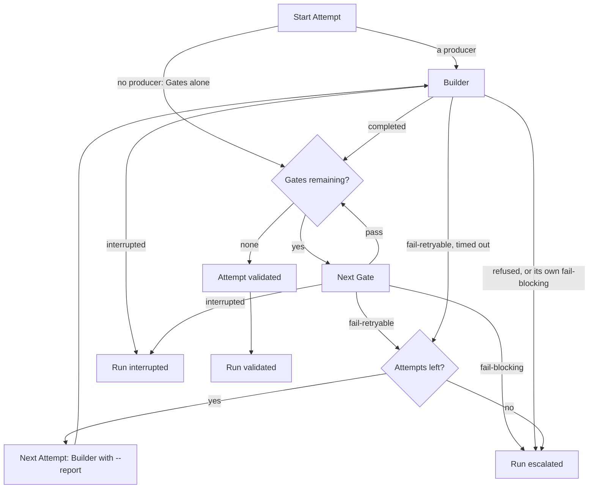

# Implementer

Independent Transformer: it has a binary, a contract, and nothing else. This paragraph
is the only place this spec talks about the rest of the system. From here on,
Implementer is alone. Its code, identifiers, comments, and messages name only
what it owns: the Task, its arguments, the workspace path, Builder, Gates,
Attempts, Traces, Status, clocks, and the run outcome. No other component is
mentioned there, because none of them exist inside this perimeter.

Implementer runs **one Task** in a directory it did not create. It
launches the Builder, then the Gate sequence it was given (that sequence may be
empty), and loops Attempts until the run is validated, escalated, or
interrupted.

The workspace is the only place files belong: that is where the Builder writes.
Intention, definition of done, reports, bounds — arguments, never files.

Stack and binary layout: [README.md](./README.md).

## 1. Job

```
  arguments                      Implementer                      children
  ---------                      -----------                      --------
  Task                           one invocation                   Builder, once per Attempt
  workspace                      Attempt loop                     each Gate, in order, per Attempt
  Builder                        until a run outcome
  ordered Gates (may be none)
  bounds
                             ←   run outcome + Traces + Status
```

**In:** arguments. **Out:** one run outcome, a Trace per Attempt that ran, and
a live Status each time it changes. Implementer does not persist. It does not
wait for the listener to acknowledge. It does not write files.

## 2. Options

Implementer is invoked with arguments. It does not read an input file. It does
not read configuration from the workspace.

| Argument                      | Content                                                                                                                     |
| ----------------------------- | --------------------------------------------------------------------------------------------------------------------------- |
| `--id`                        | Task id. Copied onto every Trace.                                                                                           |
| `--intention`                 | Passed through to Builder and Gates. Implementer does not interpret it.                                                     |
| `--definition-of-done`        | Passed through to Builder and Gates. Implementer does not evaluate it.                                                      |
| `--workspace`                 | Absolute path. Must already exist. Working directory of Builder and Gates. The only directory this process treats as files. |
| `--builder -- <argv…>`        | Builder command. Non-empty. **May be omitted**: an Attempt is then its Gate sequence alone, and nothing is produced.        |
| `--builder-timeout-ms`        | Positive integer. **Required.** Wall clock of one producer run. Nothing else bounds it.                                     |
| `--repair-builder -- <argv…>` | Optional producer for a pass that has something to resolve. Needs a `--builder` to fall back to.                            |
| `--repair-builder-timeout-ms` | Optional. Wall clock of that producer. Absent: `--builder-timeout-ms`.                                                      |
| `--gate <id> -- <argv…>`      | One Gate. Repeatable; order is the sequence. **May be omitted** (empty sequence). Each `id` unique. Command non-empty.      |
| `--gate-timeout-ms`           | Positive integer. **Required before each `--gate`.** Wall clock of that Gate.                                               |
| `--max-attempts`              | Positive integer. Attempts this invocation may start.                                                                       |
| `--report`                    | Optional. Failure report passed to the producer on Attempt 1 (and kept for retries).                                        |
| `--report-from`               | Optional. Which Gate produced `--report`, when a Gate did.                                                                  |
| `--context`                   | Optional. Larger piece of work this Task belongs to. Passed through to the producer, and named as `key` on every progress line. |
| `--stage`                     | Optional. `unit` or `assembly`. Passed to Gates. Absent: Gates receive `unit`.                                              |
| `--on-status -- <argv…>`      | Optional. Command to run each time Status changes. Omitted: Status still goes to stdout.                                    |

No other argument is read.

Malformed arguments, missing workspace, empty command, duplicate Gate ids, or a
non-positive bound → run outcome `invalid-invocation`. No Attempt.

A Task with neither a Builder nor a Gate has nothing to do and nothing to judge:
that is an empty invocation, and it validates.

## 3. Workflow

One invocation runs the whole Attempt loop.

An Attempt is one pass: Builder, then Gates from the start of the list, stopping
at the first non-pass. Numbered from 1. It starts when the Builder is spawned.

The run is `validated` only when **every** Gate passes in the **same** Attempt.
An empty list after a completed Builder is validation: Implementer adds no Gate
of its own.

```
Start Attempt 1.
  Run Builder.
  If Builder does not complete → end Attempt (§5).
  Else run Gates in list order.
    Empty list → Attempt `validated`.
    First non-pass → Attempt ends with that verdict.
    All pass → Attempt `validated`.
  After an Attempt:
    `validated`     → run `validated`.
    `fail-blocking` → run `escalated` (do not start another Attempt).
    `interrupted`   → run `interrupted`.
    `fail-retryable` and no Attempts left
                    → run `escalated`.
    `fail-retryable` otherwise
                    → next Attempt.
                      Builder receives `--report` with the failing Gate's
                      report (or the Builder failure detail if no Gate ran).
                      Gates restart from the first in the list.
```



Rules of the loop are a pure function of verdicts, Attempt count, and clocks:
no process spawn inside that function, so it is testable without a Builder.

## 4. Ceilings and interrupt

**Every child carries its own, and no other.** The producer takes
`--builder-timeout-ms` (or `--repair-builder-timeout-ms` when that producer
runs); each Gate takes the `--gate-timeout-ms` written before it. Reaching one
kills that child and ends the Attempt as `fail-retryable`, which the loop then
decides on like any other retryable failure.

**"Kills that child" means everything it started.** A producer is a chain — a
script, an agent, the vendor CLI, its shells — and a ceiling that stopped only
the first would let the rest run on, holding the pipes open, until the agent
ended by itself: an Attempt would outlive its ceiling and be judged lost while
its work was done. Every child runs as the leader of its own process group and
is ended by signalling the group and every descendant `ps` lists under it — a
vendor CLI may start its shells in groups of their own. After a kill the pipes
are cut two seconds later, so a process that still escaped cannot hold the
outcome back. What is
still running when the invocation itself exits is killed.

**Nothing is derived from what another child left behind.** There is no Attempt
clock and no Task clock. A budget computed from a deadline is how a producer
that overran left its Gates a millisecond to answer in — they were killed on
the clock instead of judging the work, and the judgement was lost, not just the
build.

**What bounds a whole invocation** is therefore what the Project wrote, and it
is arithmetic anyone can do: `--max-attempts` times the producer's ceiling plus
the sum of the Gates'. Add the status hook, which is capped at 5s per call.

**Interrupt.** SIGINT and SIGTERM stop this invocation. Kill the child, end the
in-flight Attempt as `interrupted`, return `interrupted`. Do **not** delete
`--workspace`.

## 5. Builder

Working directory: `--workspace`. Implementer appends arguments to the Builder
command. It sets no extra environment variables of its own (the process still
inherits the environment).

| Argument               | Content                                                                                                                                          |
| ---------------------- | ------------------------------------------------------------------------------------------------------------------------------------------------ |
| `--id`                 | Task id                                                                                                                                          |
| `--attempt`            | Attempt number, decimal                                                                                                                          |
| `--intention`          | The `--intention` given to Implementer                                                                                                           |
| `--definition-of-done` | The `--definition-of-done` given to Implementer                                                                                                  |
| `--report`             | Previous Attempt's failure report (JSON `report` from that child's stdout), or `--report` given to Implementer. **Omitted** when neither exists. |
| `--report-from`        | Present when a Gate produced that report.                                                                                                        |
| `--context`            | Present when `--context` was given to Implementer.                                                                                               |

Exit 0: the Builder finished its pass. Implementer does not inspect the
workspace.

| What happened                                                     | Attempt `ended`      | `--report` on the next Builder, if any |
| ----------------------------------------------------------------- | -------------------- | -------------------------------------- |
| Exit 0                                                            | completed; run Gates | —                                      |
| Stdout is JSON `{ "outcome": "fail-blocking", "report": "..." }`  | `fail-blocking`      | that `report`                          |
| Stdout is JSON `{ "outcome": "fail-retryable", "report": "..." }` | `fail-retryable`     | that `report`                          |
| Non-zero exit, no such JSON                                       | `fail-retryable`     | the end of stdout and stderr (8 KiB)                     |
| Killed by a clock                                                 | `fail-retryable`     | which clock, then what the child wrote                   |
| Stop signal                                                       | `interrupted`        | none                                                     |
| Cannot spawn (not found, not executable)                          | `fail-blocking`      | why                                                      |

`outcome` on that optional JSON is only `fail-retryable` or `fail-blocking`.
Exit 0 is completion; there is no `pass` object. Other fields are ignored.

A Builder that cannot proceed returns `fail-blocking` with the reason in
`report`.

## 6. Gates

The sequence is the `--gate` arguments, in that order. Implementer does not add
Gates, does not reorder them, and does not skip one because an earlier Attempt
passed it.

Working directory: `--workspace`. Implementer appends arguments to the Gate
command. No `--report`: the Gate judges the workspace.

| Argument               | Content                               |
| ---------------------- | ------------------------------------- |
| `--id`                 | Task id                               |
| `--attempt`            | Attempt number, decimal               |
| `--gate-id`            | This Gate's `id`                      |
| `--intention`          | Same as the Builder                   |
| `--definition-of-done` | Same as the Builder                   |
| `--stage`              | `unit` or `assembly` (default `unit`) |

Stdout: one JSON object.

```json
{
  "verdict": "pass",
  "report": "optional; required when not pass"
}
```

| `verdict`        | Meaning                                                                                            |
| ---------------- | -------------------------------------------------------------------------------------------------- |
| `pass`           | Next Gate, or validate if this was the last.                                                       |
| `fail-retryable` | Stop the sequence. New Attempt if budget remains; next Builder gets `--report` with this `report`. |
| `fail-blocking`  | Stop the sequence. Escalate. No further Attempt.                                                   |

| What happened                     | Verdict used                                                   |
| --------------------------------- | -------------------------------------------------------------- |
| Valid JSON with a known `verdict` | that verdict; `report` as given (empty on `pass` if omitted)   |
| Stdout is not that JSON           | `fail-blocking`, and the report ends with what the child wrote |
| Cannot spawn                      | `fail-blocking`                                                |
| Killed by a clock                 | `fail-retryable`, report names the clock, then what it wrote   |
| Stop signal                       | Attempt `interrupted`                                          |

A Gate that cannot return a verdict on the work returns `fail-blocking`. If it
must wait on something, it waits inside its own process until it can return
one of the three verdicts, or until `--gate-timeout-ms` kills it. Implementer
does not hold an Attempt open without consuming it.

## 7. Status

Status is the live snapshot of this invocation. It changes at phase boundaries
(Builder about to run, a Gate about to run, run outcome known). It is not a
history — that is the Trace. The `label` is meant to be shown as-is.

### Shape

| Field          | Content                                                                     |
| -------------- | --------------------------------------------------------------------------- |
| `phase`        | `building`, `gating`, `validated`, `escalated`, `interrupted`, or `invalid` |
| `attempt`      | Current Attempt number. Absent on `invalid`.                                |
| `max_attempts` | From `--max-attempts`. Absent on `invalid`.                                 |
| `gate_id`      | The Gate about to run. Present only when `phase` is `gating`.               |
| `label`        | Canonical display string. See below.                                        |

### Label

Built by Implementer. Do not invent another spelling.

| `phase`       | `label`                              | Example                   |
| ------------- | ------------------------------------ | ------------------------- |
| `building`    | `building:attempt-<n>:<max>`         | `building:attempt-1:3`    |
| `gating`      | `gating:<gate_id>:attempt-<n>:<max>` | `gating:lint:attempt-1:3` |
| `validated`   | `validated:attempt-<n>:<max>`        | `validated:attempt-2:3`   |
| `escalated`   | `escalated:attempt-<n>:<max>`        | `escalated:attempt-3:3`   |
| `interrupted` | `interrupted:attempt-<n>:<max>`      | `interrupted:attempt-1:3` |
| `invalid`     | `invalid`                            | `invalid`                 |

`<n>` and `<max>` are decimal, no padding. `<gate_id>` is the id from `--gate`.

### When it is announced

| Moment                                                | `phase`      |
| ----------------------------------------------------- | ------------ |
| Arguments or workspace unusable                       | `invalid`    |
| Builder about to spawn                                | `building`   |
| A Gate about to spawn                                 | `gating`     |
| Run outcome `validated` / `escalated` / `interrupted` | that outcome |

Announced on stdout as a JSON line (`event`: `status`) carrying the fields
above. If `--on-status` was given, Implementer also runs that command, cwd
unchanged (not the workspace), and appends:

| Argument         | Content                               |
| ---------------- | ------------------------------------- |
| `--id`           | Task id                               |
| `--label`        | The label                             |
| `--phase`        | The phase                             |
| `--attempt`      | Present when the phase has an Attempt |
| `--max-attempts` | Present when the phase has an Attempt |
| `--gate-id`      | Present when `phase` is `gating`      |

`--on-status` does not count against Attempt or Task clocks. A non-zero exit,
a missing command, or a hang that Implementer must kill does **not** change
the run outcome. Visibility must not take the Task down.

## 8. Trace and progress

### Trace

What an Attempt leaves so the result can be understood without replaying.

| Field     | Content                                                                                                                                             |
| --------- | --------------------------------------------------------------------------------------------------------------------------------------------------- |
| `task_id` | From `--id`.                                                                                                                                        |
| `attempt` | Number, from 1.                                                                                                                                     |
| `builder` | Input (intention, definition of done, previous `--report` if any) and result (completed / failed / timed out / interrupted / refused, plus detail). |
| `gates`   | One entry per Gate **that ran**, in order: `id`, verdict, report. Gates not reached are absent.                                                     |
| `ended`   | `validated`, `fail-retryable`, `fail-blocking`, or `interrupted`.                                                                                   |

`escalated` after at least one Attempt **must** carry that Attempt's Trace.
An escalation with no Trace when an Attempt existed is invalid.
`invalid-invocation` has no Trace.

### Progress

JSON lines on stdout. A `status` line is the live snapshot (§7). The other
lines rebuild the Trace.

| `event`            | When                        |
| ------------------ | --------------------------- |
| `status`           | Each time Status changes    |
| `attempt-started`  | Builder about to spawn      |
| `builder-finished` | Builder ended or was killed |
| `gate-finished`    | A Gate ended or was killed  |
| `attempt-finished` | Attempt `ended` is known    |
| `run-finished`     | Run outcome is known        |

Each line carries `task_id`, `attempt` when an Attempt exists, and enough
to rebuild the Trace without reading the workspace. When `--context` was given,
every line — `status` included — also carries it as `key`: a Task id names the
unit of work and not the feature it serves, and a reader holding `s1` alone
cannot say which feature that was. Nothing is invented: no `--context`, no `key`.

### Filming a child

A caller may hand `runImplementer` an `onChild`. It is asked once per child
about to run — the producer, then each Gate — and answers a sink, or nothing to
leave that child unfilmed. Implementer opens no file and knows nothing of where
a sink writes.

A sink is opened after the child is running and closed exactly once, on every
way out: exited, timed out, interrupted, or killed for writing past the output
bound. Chunks reach it before that bound is applied — the bound protects this
process's memory, and a child killed for saying too much is the one whose words
are worth keeping. Nothing a sink does changes a run's outcome; the default is
no sink at all, and a child's output then leaves Implementer as it always has:
a verdict, or the tail of a crash.

Implementer creates no file under `--workspace`. The Builder (and Gates, if
they must) may write there — that is the work. Implementer deletes nothing
there.

## 9. Run outcomes

Exactly one per invocation. The meaning is entirely inside this process.

| Outcome              | Meaning                                                        |
| -------------------- | -------------------------------------------------------------- |
| `invalid-invocation` | Arguments or workspace unusable. No Attempt.                   |
| `validated`          | An Attempt ended `validated`.                                  |
| `escalated`          | `fail-blocking`, or a retryable failure with no Attempts left. |
| `interrupted`        | Stop signal.                                                   |

No partial validation. Implementer never deletes `--workspace`.

## 10. Acceptance

1. No `--gate`, Builder exits 0 → `validated` after Attempt 1.
2. A `fail-retryable` Gate → new Attempt from the first Gate; Builder receives `--report` with that `report`.
3. A Gate that passed on Attempt 1 runs again on Attempt 2.
4. `fail-blocking` → `escalated`, no further Attempt, with a Trace.
5. `--max-attempts` exhausted on retryable failure → `escalated`, with a Trace.
6. SIGTERM during Builder or a Gate → `interrupted`, workspace still on disk.
7. Implementer never deletes the workspace, never requires a Gate, never writes an intention or report file.
8. The loop's decisions are unit-testable with no child process.
9. Entering the Builder on Attempt 1 of `--max-attempts 3` announces `label` `building:attempt-1:3` on stdout, and via `--on-status` when that argument is set.
10. `--on-status` exiting non-zero does not change a `validated` run.

How to build and run this Transformer: [README.md](./README.md).
