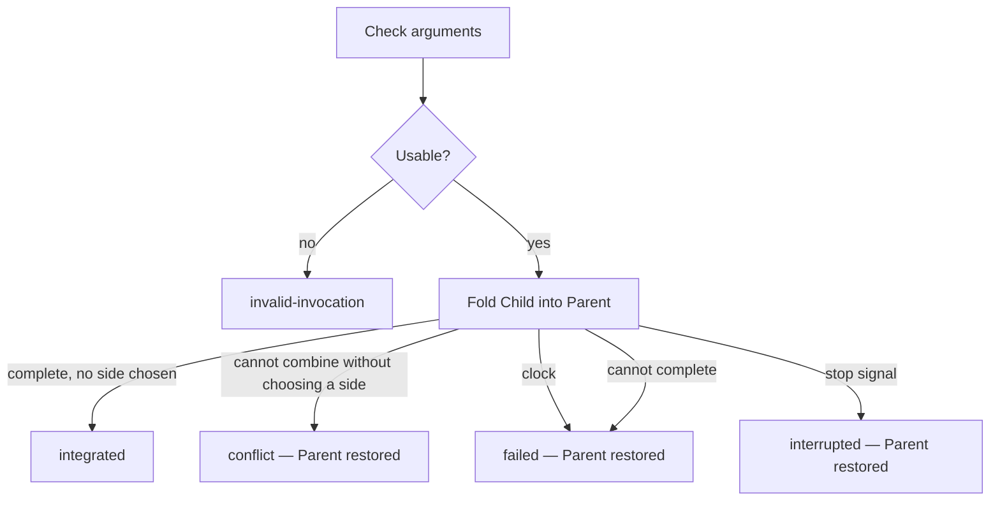

# Integrator

Independent Transformer: it has a binary, a contract, and nothing else. Integrator is
alone. Its code, identifiers, comments, and messages name only what it owns: the
Integration, its arguments, the Parent path, the Child path, Status, clocks, and
the Integration outcome. No other component is mentioned there, because none of
them exist inside this perimeter.

Integrator runs **one Integration**. It takes a Child directory and a Parent
directory, both of which already exist. It folds the Child's working files into
the Parent's working files. It never forces that fold: when the two trees cannot
be combined without choosing a side, the outcome is `conflict`.

The invocation is always the same. How Integrator folds is an injected
**Fold backend** (`fold`). Integrator does not choose a strategy. The CLI
requires `--strategy <specifier>`; Host loads the package named in
`workLine.isolation`. Strategies live under `packages/plugins/isolation-*`.

Integrator does not create either directory. It does not delete either
directory. It does not run work in either directory. A directory that is Parent
of one Integration may be Child of another; Integrator does not know or care.

Stack and binary layout: [README.md](./README.md).

## 1. Job

```
  arguments                      Integrator                       disk
  ---------                      ----------                       ----
  Integration                    one invocation                   write Parent only on `integrated`
  Parent                         fold Child working files         do not write Child working files
  Child                          into Parent, never forced        do not create or delete either
  bounds
                             ←   Integration outcome + Status
```

**In:** arguments. **Out:** one Integration outcome, and a live Status each time
it changes. Integrator does not wait for a listener to acknowledge.

## 2. Options

Integrator is invoked with arguments. It does not read an input file. It does
not read configuration from the Parent or the Child.

| Argument                 | Content                                                                                                 |
| ------------------------ | ------------------------------------------------------------------------------------------------------- |
| `--id`                   | Integration id. Copied onto every Status and progress line. Non-empty.                                  |
| `--context`              | Optional. The Feature this integration serves. Named as `key` on every Status and progress line. |
| `--parent`               | Absolute path. Must already exist as a directory. Destination of the fold.                              |
| `--child`                | Absolute path. Must already exist as a directory. Source of the fold. Integrator does not create this.  |
| `--duration-ms`          | Positive integer. Wall clock of the Integration, from the moment Integrator starts folding into Parent. |
| `--strategy`             | Package name or path. CLI only. Loads `strategy.fold`. `runIntegrator` receives the backend as an argument; it never chooses one. |
| `--on-status -- <argv…>` | Optional. Command to run each time Status changes. Omitted: Status still goes to stdout.                |

The import face may also pass `subject` and `mergeSubject` through to the Fold backend (commit messages for the fold). They are not CLI arguments.

No other argument is read.

Malformed arguments, empty id, non-absolute path, missing Parent, missing Child,
Parent or Child not a directory, Parent and Child the same path, Parent a prefix
of Child, Child a prefix of Parent, or a non-positive `--duration-ms` →
Integration outcome `invalid-invocation`. No fold is attempted. Parent and Child
are left as they were.

## 3. Workflow

One invocation runs one Integration. There is no loop.

```
Check arguments and paths (§2). Unusable → `invalid-invocation`.
Announce Status `integrating`.
Start the Integration clock.
Fold the Child's working files into the Parent (§4).
  If the fold cannot complete without choosing a side
    → restore Parent to invocation start → Integration outcome `conflict`.
  If the clock fires, a stop signal arrives, or the fold cannot complete
    for a reason that is not a conflict
    → restore Parent to invocation start → Integration outcome `failed` or `interrupted` (§5).
  If the fold completes without choosing a side
    → Integration outcome `integrated`. Parent holds the result. Child stays as it was.
```



## 4. Integration

Integration is a property of two directories after a successful invocation. It
is not a later process, not a snapshot, and not a lock on either directory.

### Fold backend

Integrator does not choose a strategy. The caller injects a `FoldBackend`.
Strategies live under `packages/plugins/isolation-*` and export
`strategy: { isolation, fold }`.

The binary's `cli.ts` requires `--strategy <specifier>` and loads that package.
Host resolves `workLine.isolation` the same way. There is no `.git` sniff and no
`"git"` / `"copy"` alias. A strategy **conflict** is `conflict`. A strategy
failure that is not a conflict is `failed`, not a silent switch to another
method.

`.git` at the root of Parent or Child is not a working file. Integrator does
not fold it as content.

Same `--id`, `--parent`, `--child`. Same outcomes. The working-file contract
(§4) holds either way.

### Working files

At Integration start, Integrator reads each directory's **working files**: the
tree a process with that directory as its working directory would see as the
work.

When the Integration outcome is `integrated`:

- The Parent's working files are the combination of both trees: every change
  that exists only in the Child is present in the Parent, and every change that
  exists only in the Parent is still present in the Parent.
- The Child's working files are what they were at invocation start.

The contract is the working files. Git vs copy is how Integrator combines them.

Uncommitted working-file changes participate. Integrator does not ignore a
change because it is not a commit.

### Never force

Integrator never chooses a side to make a **conflict** succeed. It never
overwrites a conflicting Parent path with the Child, or the reverse. It never
deletes a conflicting Parent path to accept the Child. It never writes
conflict-marker content into Parent working files. It never passes a force
option to git. It never rewrites the Parent's git history (no hard reset of
existing commits, no discard of Parent commits) to make a merge succeed.

A merge commit that **adds** history is not a rewrite. Force-taking one side of
a conflict is.

### Conflict

A **conflict** is when the fold cannot complete without choosing a side.

On git, that is an overlapping independent change on the same path (both sides
edited it, or the types cannot be combined). Different bytes on a path is not
by itself a conflict: a change that exists on only one side is applied.

On copy, that is an incompatible type at the same path (file vs directory vs
symlink). Copy has no third tree, so it cannot see overlapping independent
edits; a same-type bytes difference is incoming Child work (§4 Copy merge), not
a conflict.

On `conflict`:

- Parent working files are what they were at invocation start. No partial fold
  remains. No conflict-marker files remain.
- Child working files are what they were at invocation start.
- Both directories still exist.

`conflict` is a complete Integration outcome. It is not `failed`. The fold was
possible to attempt and must not be forced.

### Git merge

When Integrator uses git, it merges the Child into the Parent using git. This
is a three-way merge of working files. The Child is the incoming side. The
Parent is the destination side. Git's merge finds whether a path changed on
both sides independently.

| Situation                                                | Result on Parent     | Outcome     |
| -------------------------------------------------------- | -------------------- | ----------- |
| Path changed only in the Child                           | Child's content      | (continues) |
| Path changed only in the Parent                          | Parent's content     | (continues) |
| Path unchanged on both, or still the same bytes          | Parent's content     | (continues) |
| Path changed on both, changes cannot be combined         | restored, not merged | `conflict`  |
| Git cannot run or cannot complete (not a merge conflict) | restored             | `failed`    |

When every path continues and the fold completes → `integrated`.

Integrator does not fall back to copy after a git conflict or a git failure.

If `--parent/.git` exists and the Child is not usable as a git incoming side
(missing `.git`, unrelated repo, git refuses the merge for a reason that is not
a content conflict), the outcome is `failed`, not `conflict`, not copy.

### Copy merge

When Integrator uses copy, it merges working files without git. Copy has no
ancestor tree, so it cannot tell a Parent-only edit from a Child-only edit on
the same path. The Child is the incoming working tree. Integrator applies this
path-wise fold, skipping `.git` only at the root of Parent and the root of
Child:

| Parent path                | Child path                 | Action                                    |
| -------------------------- | -------------------------- | ----------------------------------------- |
| Same type and bytes        | Same type and bytes        | Leave Parent as is                        |
| Missing                    | Present                    | Copy the Child path onto Parent           |
| Present                    | Missing                    | Leave Parent as is (copy does not delete) |
| Same type, different bytes | Same type, different bytes | Take the Child's bytes (incoming work)    |
| Incompatible types         | Incompatible types         | **conflict**                              |

Copy does not choose a side of a type conflict. A bytes difference is not a
type conflict: it is the Child's work being folded. Parent-only paths stay.
Child deletions are not applied: copy cannot tell a Child delete from a Parent
addition, so it does not delete.

On a `conflict` row, Integrator stops, restores Parent to invocation start,
and does not continue the walk as a partial fold.

### Parent

Integrator writes Parent working files only when the outcome is `integrated`.
On every other outcome, Parent working files are what they were at invocation
start.

If Integrator began to write and then hit `conflict`, `failed`, or
`interrupted`, it restores Parent before returning. A leftover merge in
progress (index, merge state) does not remain.

Integrator may write git bookkeeping that is not working content, if the
Parent's storage requires it to record a completed merge. That bookkeeping is
not a working file.

Integrator never deletes the Parent.

### Child

Both directories already exist. Integrator creates neither. Integrator does not
add, remove, or edit the Child's working files. After any outcome, those files
are what they were at invocation start.

Integrator does not delete the Child, including after `integrated`. Callers
that destroy a Child do so outside this process.

### What Integrator does not do

- Interpret files in the Parent or the Child (no language-aware merge of its own).
- Spawn a worker whose job is the content.
- Create a directory.
- Delete the Parent or the Child.
- Choose a Parent or Child path of its own: `--parent` and `--child` are the paths.
- Reuse a previous Integration's in-memory state: every invocation is the same job.
- Force a fold.

## 5. Clocks and interrupt

**Integration clock.** Starts when Integrator begins folding into the Parent. On
`--duration-ms`, Integrator stops the fold, restores Parent to invocation start,
Integration outcome `failed`. The report names the clock.

**Interrupt.** SIGINT and SIGTERM stop this invocation. Integrator stops the
fold, restores Parent to invocation start, Integration outcome `interrupted`.
It does **not** delete the Parent. It does **not** delete the Child. It does
**not** undo an Integration that already reached `integrated` (that Integration
is finished).

A stop signal that races a clock uses `interrupted`. A stop signal that races a
just-completed `integrated` fold uses `integrated`.

## 6. Status

Status is the live snapshot of this invocation. It changes at phase boundaries
(Integration about to run, Integration outcome known). It is not a history. The
`label` is meant to be shown as-is.

### Shape

| Field   | Content                                                                        |
| ------- | ------------------------------------------------------------------------------ |
| `phase` | `integrating`, `integrated`, `conflict`, `failed`, `interrupted`, or `invalid` |
| `id`    | From `--id`. Absent on `invalid` when `--id` itself is unusable.               |
| `label` | Canonical display string. See below.                                           |

### Label

Built by Integrator. Do not invent another spelling.

| `phase`       | `label`            | Example              |
| ------------- | ------------------ | -------------------- |
| `integrating` | `integrating:<id>` | `integrating:feat-1` |
| `integrated`  | `integrated:<id>`  | `integrated:feat-1`  |
| `conflict`    | `conflict:<id>`    | `conflict:feat-1`    |
| `failed`      | `failed:<id>`      | `failed:feat-1`      |
| `interrupted` | `interrupted:<id>` | `interrupted:feat-1` |
| `invalid`     | `invalid`          | `invalid`            |

`<id>` is the `--id` argument, as given.

### When it is announced

| Moment                                                                   | `phase`       |
| ------------------------------------------------------------------------ | ------------- |
| Arguments or paths unusable                                              | `invalid`     |
| Fold about to start                                                      | `integrating` |
| Integration outcome `integrated` / `conflict` / `failed` / `interrupted` | that outcome  |

Announced on stdout as a JSON line (`event`: `status`) carrying the fields
above. If `--on-status` was given, Integrator also runs that command, cwd
unchanged (not the Parent, not the Child), and appends:

| Argument  | Content                      |
| --------- | ---------------------------- |
| `--id`    | Integration id, when present |
| `--label` | The label                    |
| `--phase` | The phase                    |

`--on-status` does not count against the Integration clock. A non-zero exit, a
missing command, or a hang that Integrator must kill does **not** change the
Integration outcome. Visibility must not take the Integration down.

## 7. Progress

JSON lines on stdout. A `status` line is the live snapshot (§6). The other
lines record the Integration.

| `event`                | When                         |
| ---------------------- | ---------------------------- |
| `status`               | Each time Status changes     |
| `integration-started`  | Fold about to start          |
| `integration-finished` | Integration outcome is known |

Each line carries `id` when the Integration id is usable.

`integration-finished` also carries:

| Field     | Content                                                                                 |
| --------- | --------------------------------------------------------------------------------------- |
| `outcome` | The Integration outcome (§8).                                                           |
| `parent`  | Absolute `--parent` path. Present when the outcome is `integrated`.                     |
| `report`  | Why, when `outcome` is `conflict`, `failed`, or `invalid-invocation`. Absent otherwise. |

Integrator creates no working file under the Child. It writes Parent working
files only on `integrated`. It deletes nothing under the Child. It deletes
nothing under the Parent except, on `integrated`, paths the fold must replace
as part of applying a Child-only change that is not a conflict.

## 8. Integration outcomes

Exactly one per invocation. The meaning is entirely inside this process.

| Outcome              | Meaning                                                                                                                                                               |
| -------------------- | --------------------------------------------------------------------------------------------------------------------------------------------------------------------- |
| `invalid-invocation` | Arguments or paths unusable. No fold attempted. Parent and Child untouched.                                                                                           |
| `integrated`         | Parent working files hold the combined trees. Child unchanged. Both stay.                                                                                             |
| `conflict`           | Fold cannot complete without choosing a side. Parent restored to invocation start. Child unchanged. Both stay.                                                        |
| `failed`             | Integration started and could not complete (clock, I/O, spawn of Integrator's own tools, git failure that is not a merge conflict). Parent restored. Child unchanged. |
| `interrupted`        | Stop signal before `integrated` or `conflict`. Parent restored. Child unchanged.                                                                                      |

No partial Integration. After this process exits, Parent working files are
either what they were at invocation start, or the complete `integrated` result.

## 9. Acceptance

1. Child has a path the Parent does not; Integration completes → `integrated`; Parent has that path with the Child's content; Child unchanged.
2. Parent has a path the Child does not; Integration completes → `integrated`; that Parent path is still there; Child unchanged.
3. A path exists in both with the same content; Integration completes → `integrated`; that path unchanged on Parent; Child unchanged.
4. `@bluewombat/isolation-git`; a path changed only in the Child (Parent still has the pre-change bytes) → `integrated`; Parent has the Child's bytes; Child unchanged.
5. `@bluewombat/isolation-git`; a path changed only in the Parent (Child still has the pre-change bytes) → `integrated`; Parent keeps its bytes; Child unchanged.
6. `@bluewombat/isolation-git`; both sides changed the same path with different bytes that git cannot combine → `conflict`; Parent still has its invocation-start content; Child unchanged; no conflict-marker files on Parent.
7. `@bluewombat/isolation-copy`; a path exists in both with different bytes of the same type → `integrated`; Parent has the Child's bytes (copy incoming work); Child unchanged.
8. A path exists in both with incompatible types → `conflict`; Parent restored; Child unchanged.
9. `--child` missing, `--parent` missing, relative path, empty `--id`, `--child` inside `--parent`, or `--parent` inside `--child` → `invalid-invocation`; both directories left as they were when they existed.
10. SIGTERM during the fold → `interrupted`; Parent working files are the invocation-start tree; Child remains on disk with its invocation-start tree.
11. Integration clock fires during the fold → `failed`; Parent restored; Child remains; report names the clock.
12. Integrator never deletes the Parent, never deletes the Child, never writes a working file of its own into the Child, never chooses a side on a conflict, never leaves a partial fold on Parent.
13. A directory that was Parent of one Integration can be `--child` of another; that second Integration is the same job.
14. Entering the fold with `--id feat-1` announces `label` `integrating:feat-1` on stdout, and via `--on-status` when that argument is set.
15. `--on-status` exiting non-zero does not change an `integrated` Integration.
16. `@bluewombat/isolation-git` → git inside; a git merge conflict is `conflict`, not copy; Parent restored; Child unchanged.
17. `@bluewombat/isolation-copy` → copy inside; a same-type bytes difference is taken from the Child, not `conflict`.
18. `@bluewombat/isolation-git` and git cannot complete for a reason that is not a merge conflict → `failed`, not a copy, not `conflict`.
19. The CLI requires `--strategy <specifier>`; `runIntegrator` never chooses a strategy.

How to build and run this Transformer: [README.md](./README.md).
