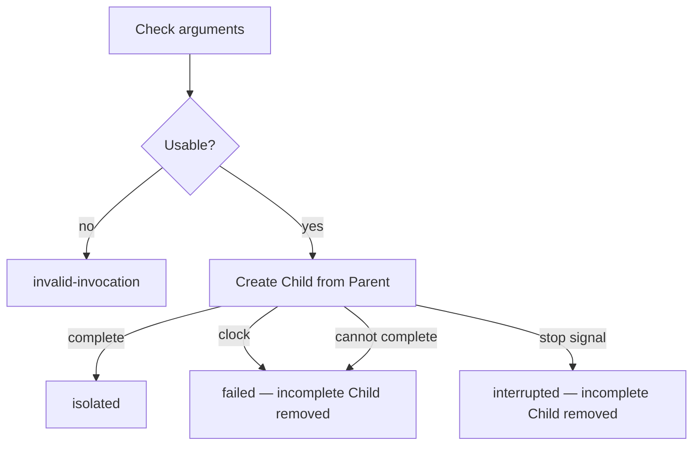

# Isolator

Independent Transformer: it has a binary, a contract, and nothing else. Isolator is
alone. Its code, identifiers, comments, and messages name only what it owns: the
Isolation, its arguments, the Parent path, the Child path, Status, clocks, and
the Isolation outcome. No other component is mentioned there, because none of
them exist inside this perimeter.

Isolator runs **one Isolation**. It takes a Parent directory it did not create
and produces a Child directory that did not exist. The Child is a snapshot of
the Parent's working files at Isolation time, then independent of the Parent.

The invocation is always the same. How Isolator produces the Child is an
injected **Isolation backend** (`attach` / `abort`). Isolator does not choose a
strategy. The CLI requires `--strategy <specifier>`; Host loads the package
named in `workLine.isolation`. Strategies live under `packages/plugins/isolation-*`.

Isolator does not run work in either directory. It does not fold the Child back
into the Parent. It does not delete a Child that reached `isolated`.

Stack and binary layout: [README.md](./README.md).

## 1. Job

```
  arguments                      Isolator                         disk
  ---------                      --------                         ----
  Isolation                      one invocation                   create the Child
  Parent                         snapshot Parent working files    do not write Parent working files
  Child path                     then independent
  bounds
                             ←   Isolation outcome + Child path + Status
```

**In:** arguments. **Out:** one Isolation outcome, the Child path when the
outcome is `isolated`, and a live Status each time it changes. Isolator does
not wait for a listener to acknowledge.

A Child of one Isolation may be the Parent of a later Isolation. Isolator does
not know or care; every invocation is the same job.

## 2. Options

Isolator is invoked with arguments. It does not read an input file. It does not
read configuration from the Parent or the Child.

| Argument                 | Content                                                                                            |
| ------------------------ | -------------------------------------------------------------------------------------------------- |
| `--id`                   | Isolation id. Copied onto every Status and progress line. Non-empty.                               |
| `--parent`               | Absolute path. Must already exist as a directory. Working files here are the snapshot source.      |
| `--child`                | Absolute path. Must not exist. Isolator creates this directory, including missing ancestors.       |
| `--duration-ms`          | Positive integer. Wall clock of the Isolation, from the moment Isolator starts creating the Child. |
| `--strategy`             | Package name or path. CLI only. Loads `strategy.isolation`. `runIsolator` receives the backend as an argument; it never chooses one. |
| `--on-status -- <argv…>` | Optional. Command to run each time Status changes. Omitted: Status still goes to stdout.           |

No other argument is read.

Malformed arguments, empty id, non-absolute path, missing Parent, Parent not a
directory, Child already exists, Child's containing path exists but is not a
directory, Parent and Child the same path, Parent a prefix of Child, Child a
prefix of Parent, or a non-positive `--duration-ms` → Isolation outcome
`invalid-invocation`. No Child is created. Parent is left as it was.

## 3. Workflow

One invocation runs one Isolation. There is no loop.

```
Check arguments and paths (§2). Unusable → `invalid-invocation`.
Announce Status `isolating`.
Start the Isolation clock.
Create the Child as a snapshot of the Parent's working files (§4).
  If the clock fires, a stop signal arrives, or creation cannot complete
    → remove any incomplete Child → Isolation outcome `failed` or `interrupted` (§5).
  If creation completes
    → Isolation outcome `isolated`. The Child stays.
```



## 4. Isolation

Isolation is a property of two directories after a successful invocation. It is
not a later process, not a merge, and not a lock on the Parent.

### Isolation backend

Isolator does not choose a strategy. The caller injects an `IsolationBackend`
(`attach` / `abort`). Strategies live under `packages/plugins/isolation-*` and export
`strategy: { isolation, fold }`.

| Field on `attach` | Meaning |
| ----------------- | ------- |
| `id?`             | Isolation id; a strategy may derive a branch or other label from it |
| `parent` / `child` | Absolute paths |
| `timeoutMs` / `shouldInterrupt` / `shouldStop` | Budgets and stop signals |

The binary's `cli.ts` requires `--strategy <specifier>` and loads that package.
Host resolves `workLine.isolation` the same way. There is no `.git` sniff and no
`"git"` / `"copy"` alias. A strategy failure is `failed`, not a silent switch.

Git bookkeeping under the Parent (when using `@bluewombat/isolation-git`) is
Isolation bookkeeping, not working files. A copy strategy writes nothing on the
Parent.

Same `--id`, `--parent`, `--child`. Same outcomes. Snapshot and independence
(§4) hold either way.

### Snapshot

At Isolation start, Isolator reads the Parent's **working files**: the tree a
process with that directory as its working directory would see as the work.
When the Isolation outcome is `isolated`, the Child has the same relative paths
and the same content for those working files.

Isolator adds no working file of its own under the Child. The Child is the
snapshot, not a wrapper around it.

The contract is the working files. Git vs copy is how Isolator produces them.

### Independence

After `isolated`:

- A write under the Child does not change the Parent's working files.
- A write under the Parent does not change the Child's working files.

The two trees may then diverge. Isolator does not keep them in sync. A new
Isolation is a new invocation.

### Parent

Isolator does not add, remove, or edit the Parent's working files. After any
outcome, those files are what they were at invocation start.

Isolator may write Isolation bookkeeping that is not working content, if the
Parent's storage requires it to attach a Child. That bookkeeping is not a
working file.

Isolator never deletes the Parent.

### Child

Isolator creates `--child`. Missing ancestor directories are created. A
containing path that already exists and is not a directory is
`invalid-invocation`.

Isolator does not delete a Child whose Isolation outcome is `isolated`.
Callers that destroy a Child do so outside this process.

If Isolation does not complete, Isolator removes the incomplete Child so a
retry with the same `--child` is not blocked by a half-created directory. A
directory that already existed before this invocation is never that incomplete
Child — that case is `invalid-invocation` and Isolator does not touch it.

### What Isolator does not do

- Interpret files in the Parent or the Child.
- Spawn a worker whose job is the content.
- Fold the Child into the Parent.
- Reuse an existing Child.
- Overwrite `--child`.
- Choose a Child path of its own: `--child` is the path.

## 5. Clocks and interrupt

**Isolation clock.** Starts when Isolator begins creating the Child. On
`--duration-ms`, Isolator stops creation, removes any incomplete Child, Isolation
outcome `failed`. The report names the clock.

**Interrupt.** SIGINT and SIGTERM stop this invocation. Isolator stops creation,
removes any incomplete Child, Isolation outcome `interrupted`. It does **not**
delete the Parent. It does **not** delete a Child that already reached
`isolated` (that Isolation is finished).

A stop signal that races a clock uses `interrupted`.

## 6. Status

Status is the live snapshot of this invocation. It changes at phase boundaries
(Isolation about to run, Isolation outcome known). It is not a history. The
`label` is meant to be shown as-is.

### Shape

| Field   | Content                                                          |
| ------- | ---------------------------------------------------------------- |
| `phase` | `isolating`, `isolated`, `failed`, `interrupted`, or `invalid`   |
| `id`    | From `--id`. Absent on `invalid` when `--id` itself is unusable. |
| `label` | Canonical display string. See below.                             |

### Label

Built by Isolator. Do not invent another spelling.

| `phase`       | `label`            | Example              |
| ------------- | ------------------ | -------------------- |
| `isolating`   | `isolating:<id>`   | `isolating:feat-1`   |
| `isolated`    | `isolated:<id>`    | `isolated:feat-1`    |
| `failed`      | `failed:<id>`      | `failed:feat-1`      |
| `interrupted` | `interrupted:<id>` | `interrupted:feat-1` |
| `invalid`     | `invalid`          | `invalid`            |

`<id>` is the `--id` argument, as given.

### When it is announced

| Moment                                                  | `phase`      |
| ------------------------------------------------------- | ------------ |
| Arguments or paths unusable                             | `invalid`    |
| Child about to be created                               | `isolating`  |
| Isolation outcome `isolated` / `failed` / `interrupted` | that outcome |

Announced on stdout as a JSON line (`event`: `status`) carrying the fields
above. If `--on-status` was given, Isolator also runs that command, cwd
unchanged (not the Parent, not the Child), and appends:

| Argument  | Content                    |
| --------- | -------------------------- |
| `--id`    | Isolation id, when present |
| `--label` | The label                  |
| `--phase` | The phase                  |

`--on-status` does not count against the Isolation clock. A non-zero exit, a
missing command, or a hang that Isolator must kill does **not** change the
Isolation outcome. Visibility must not take the Isolation down.

## 7. Progress

JSON lines on stdout. A `status` line is the live snapshot (§6). The other
lines record the Isolation.

| `event`              | When                       |
| -------------------- | -------------------------- |
| `status`             | Each time Status changes   |
| `isolation-started`  | Child about to be created  |
| `isolation-finished` | Isolation outcome is known |

Each line carries `id` when the Isolation id is usable.

`isolation-finished` also carries:

| Field     | Content                                                                    |
| --------- | -------------------------------------------------------------------------- |
| `outcome` | The Isolation outcome (§8).                                                |
| `child`   | Absolute `--child` path. Present only when `outcome` is `isolated`.        |
| `report`  | Why, when `outcome` is `failed` or `invalid-invocation`. Absent otherwise. |

Isolator creates no working file under the Parent. It creates no working file
under the Child other than the snapshot. It deletes nothing under the Parent.

## 8. Isolation outcomes

Exactly one per invocation. The meaning is entirely inside this process.

| Outcome              | Meaning                                                                                                         |
| -------------------- | --------------------------------------------------------------------------------------------------------------- |
| `invalid-invocation` | Arguments or paths unusable. No Child created. Parent untouched.                                                |
| `isolated`           | Child exists, snapshot taken, independence holds. Child stays.                                                  |
| `failed`             | Isolation started and could not complete (clock, I/O, spawn of Isolator's own tools). Incomplete Child removed. |
| `interrupted`        | Stop signal before `isolated`. Incomplete Child removed.                                                        |

No partial Isolation. A Child that exists after this process exits was either
already there (`invalid-invocation`, left alone) or fully `isolated`.

## 9. Acceptance

1. Parent has working files; Isolation completes → `isolated`; Child has those files at the same relative paths; Parent working files unchanged.
2. After `isolated`, a new file written only under the Child is absent from the Parent.
3. After `isolated`, a new file written only under the Parent is absent from the Child.
4. `--child` already exists → `invalid-invocation`; that directory unchanged; Parent unchanged.
5. Missing Parent, relative path, empty `--id`, `--child` inside `--parent`, or `--parent` inside `--child` → `invalid-invocation`; no Child created.
6. SIGTERM during creation → `interrupted`; `--child` does not exist afterwards; Parent remains.
7. Isolation clock fires during creation → `failed`; `--child` does not exist afterwards; Parent remains.
8. Isolator never deletes the Parent, never deletes an `isolated` Child, never writes a working file of its own into the Child, never folds the Child into the Parent.
9. A Child produced by one Isolation can be `--parent` of another Isolation; that second Isolation is the same job.
10. Entering creation with `--id feat-1` announces `label` `isolating:feat-1` on stdout, and via `--on-status` when that argument is set.
11. `--on-status` exiting non-zero does not change an `isolated` Isolation.
12. `@bluewombat/isolation-git` → `isolated` via git; Child is a worktree; Parent working files unchanged; independence holds.
13. `@bluewombat/isolation-copy` → `isolated` via copy; same snapshot and independence; Parent unchanged.
14. `@bluewombat/isolation-git` and git cannot complete → `failed`, not a copy.
15. `--child` whose containing directory is missing → Isolator creates the ancestors; `isolated`.
16. The CLI requires `--strategy <specifier>`; `runIsolator` never chooses a strategy.

How to build and run this Transformer: [README.md](./README.md).
